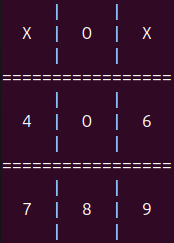

## XO
#A simple Tic Tac Toe game in pure C with implemented computer logic
This project is under the MIT license.
This project does not use any external libraries except the standard ones.




To run this program you will need a compiler (GCC, TCC.. etc)


You can simply build it using make
```bash
make build run
```

Or you can use any your compiler
Example: GCC
```bash
gcc main.c -o main
```

Run it with
```bash
./main
```
